# Arquitectura de modelos

Este documento describe la arquitectura del bloque de modelos utilizado para la clasificación de emociones.

El objetivo no es documentar toda la arquitectura del sistema, sino explicar cómo se organizan, entrenan, comparan y seleccionan los modelos de aprendizaje automático usados en el proyecto.

La arquitectura sigue un enfoque de modelos supervisados sobre un vector de características facial. Distintos clasificadores reciben la misma representación de entrada y son evaluados bajo un mismo flujo experimental.

---

## 1. Vista general de la arquitectura

El sistema de modelado se organiza como una arquitectura de comparación multi-modelo. Todos los modelos reciben como entrada el mismo vector de características y producen una predicción de emoción. Posteriormente, sus resultados se comparan mediante métricas de desempeño para seleccionar el modelo más adecuado.

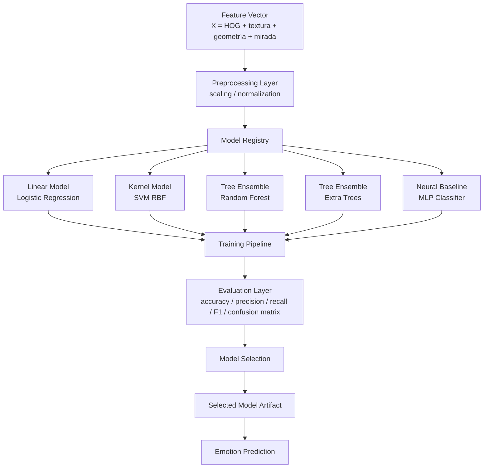

---

## 2. Entrada común de los modelos

Los modelos no reciben directamente la imagen completa como entrada. La entrada común es un vector de características construido a partir de información facial previamente procesada.

Conceptualmente, cada muestra se representa como:

```text
X_i = [HOG_i, texture_i, geometry_i, gaze_i]
```

donde:

| Componente | Descripción |
|---|---|
| `HOG_i` | Descriptor de gradientes orientados extraído del rostro |
| `texture_i` | Rasgos de textura facial |
| `geometry_i` | Rasgos geométricos del rostro |
| `gaze_i` | Rasgos relacionados con ojos, mirada o atención visual |

Cada vector `X_i` se asocia con una etiqueta emocional `y_i`.

```text
X_i -> y_i
```

Las clases consideradas corresponden a emociones faciales como:

```text
Angry
Disgust
Fear
Happy
Sad
Surprise
Neutral
```

---

## 3. Capa de representación de características

La capa de representación convierte la información facial en una entrada numérica compatible con modelos clásicos de aprendizaje automático.

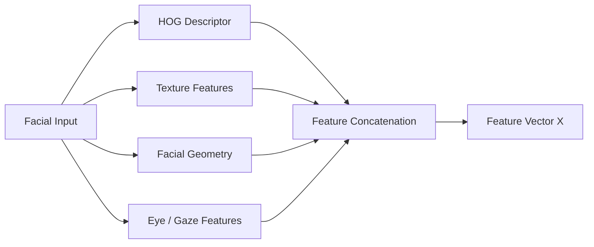

Esta capa es importante porque todos los clasificadores se entrenan sobre la misma representación. Por lo tanto, la comparación entre modelos se realiza de forma justa: cambia el algoritmo de clasificación, pero no cambia la entrada.

---

## 4. Capa de preprocesamiento del vector

Antes de entrenar los modelos, el vector de características pasa por una etapa de preprocesamiento.

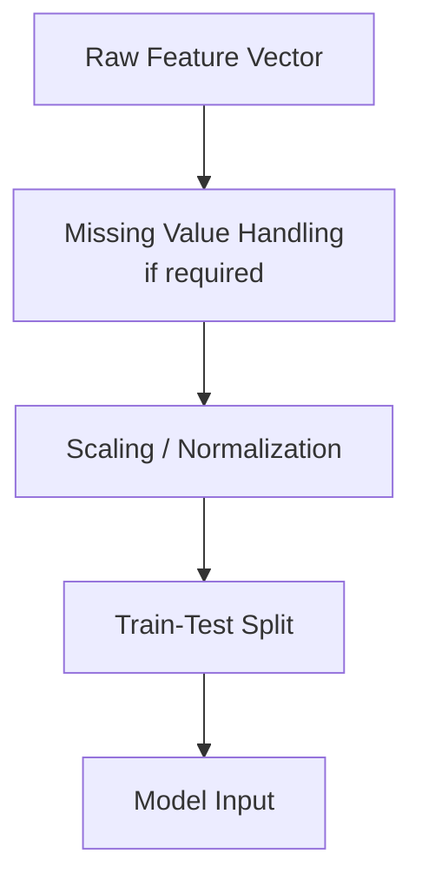

El escalado es especialmente relevante para modelos sensibles a la magnitud de las variables, como:

```text
SVM con kernel RBF
Logistic Regression
MLP Classifier
```

En modelos basados en árboles, como Random Forest y Extra Trees, el escalado suele ser menos crítico. Aun así, se mantiene dentro del pipeline para conservar una entrada homogénea y facilitar la comparación experimental.

---

## 5. Model Registry

El proyecto se organiza mediante un registro de modelos o Model Registry. Este componente agrupa todos los clasificadores considerados dentro del experimento.

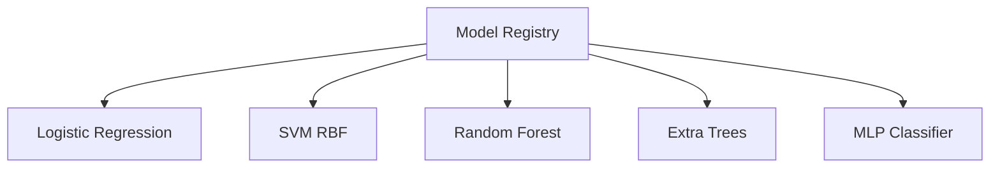

El Model Registry permite que todos los modelos sean entrenados, evaluados y comparados bajo la misma estructura.

---

## 6. Familias de modelos utilizadas

Los modelos usados se pueden organizar en cuatro familias principales:

| Familia | Modelo | Propósito |
|---|---|---|
| Modelo lineal | Logistic Regression | Baseline interpretable |
| Modelo de kernel | SVM con kernel RBF | Clasificación no lineal con margen |
| Ensambles de árboles | Random Forest, Extra Trees | Modelos robustos para relaciones no lineales |
| Modelo neuronal | MLP Classifier | Baseline neuronal para combinaciones no lineales |

Esta organización permite cubrir distintos tipos de fronteras de decisión: lineales, no lineales por kernel, no lineales basadas en árboles y no lineales aprendidas por una red multicapa.

---

## 7. Logistic Regression

`Logistic Regression` funciona como modelo lineal de referencia. Su papel dentro de la arquitectura es servir como baseline interpretable para evaluar si el vector de características permite separar emociones mediante una frontera lineal.

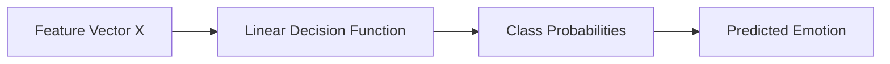

| Aspecto | Descripción |
|---|---|
| Tipo de modelo | Lineal |
| Ventaja | Simple, rápido e interpretable |
| Limitación | Puede ser insuficiente si las emociones no son linealmente separables |
| Uso principal | Baseline de comparación |

---

## 8. SVM con kernel RBF

`SVM con kernel RBF` permite construir fronteras de decisión no lineales. Es útil cuando las clases emocionales se distribuyen de forma compleja dentro del espacio de características.

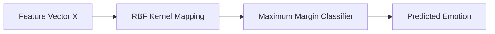

| Aspecto | Descripción |
|---|---|
| Tipo de modelo | Kernel-based classifier |
| Ventaja | Captura separaciones no lineales |
| Limitación | Sensible a hiperparámetros y escalado |
| Uso principal | Modelo no lineal fuerte sobre rasgos faciales |

---

## 9. Random Forest Classifier

`Random Forest Classifier` es un ensamble de árboles de decisión. Cada árbol aprende reglas sobre subconjuntos de datos y variables. La predicción final se obtiene agregando las predicciones individuales.

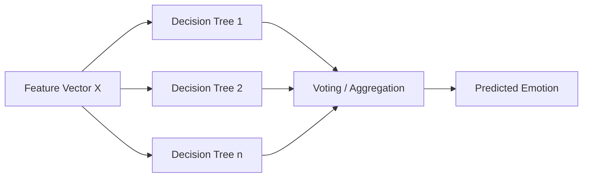

| Aspecto | Descripción |
|---|---|
| Tipo de modelo | Ensamble de árboles |
| Ventaja | Robusto, estable y capaz de capturar no linealidad |
| Limitación | Menos interpretable que un modelo lineal simple |
| Uso principal | Clasificador robusto para rasgos heterogéneos |

---

## 10. Extra Trees Classifier

`Extra Trees Classifier`, o Extremely Randomized Trees, también pertenece a la familia de ensambles de árboles. Introduce mayor aleatoriedad en la construcción de los árboles, lo que puede mejorar la generalización en ciertos conjuntos de datos.

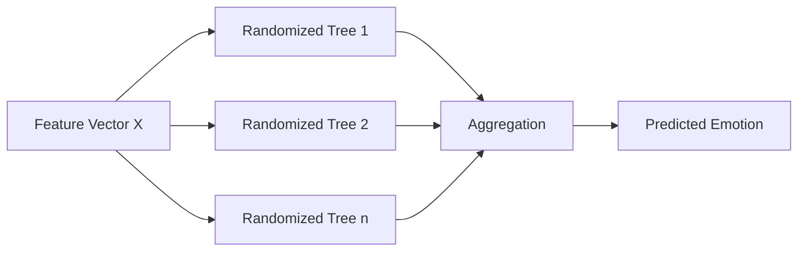

| Aspecto | Descripción |
|---|---|
| Tipo de modelo | Ensamble de árboles extremadamente aleatorizados |
| Ventaja | Captura patrones no lineales con alta aleatoriedad |
| Limitación | Puede ser menos estable si no se ajustan bien sus parámetros |
| Uso principal | Alternativa robusta a Random Forest |

---

## 11. MLP Classifier

`MLP Classifier` es un modelo neuronal multicapa. A diferencia de Logistic Regression, puede aprender combinaciones no lineales entre las características extraídas.


| Aspecto | Descripción |
|---|---|
| Tipo de modelo | Red neuronal feedforward |
| Ventaja | Aprende relaciones no lineales entre características |
| Limitación | Requiere ajuste cuidadoso y puede sobreajustar |
| Uso principal | Baseline neuronal clásico |

---

## 12. Arquitectura comparativa de los modelos

La siguiente vista resume cómo todos los modelos se integran dentro del mismo flujo experimental.

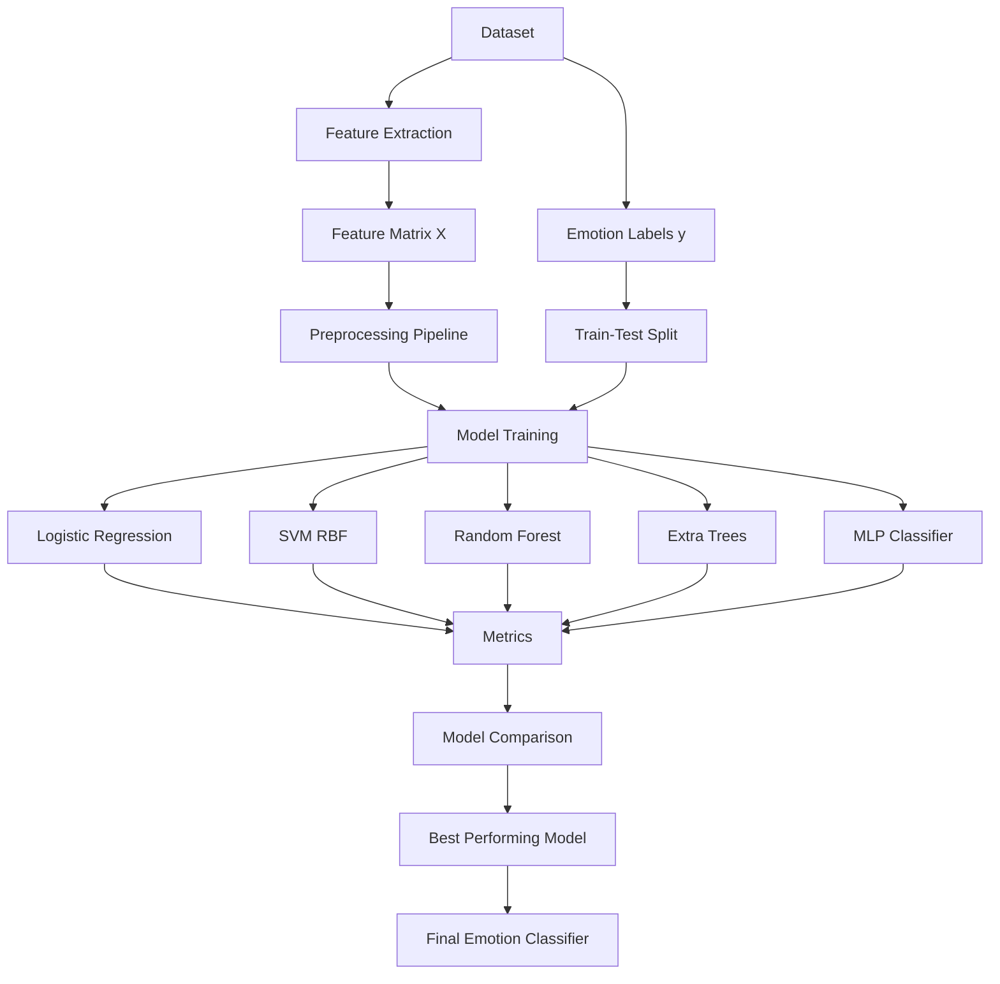

---

## 13. Pipeline de entrenamiento

El entrenamiento se realiza aplicando el mismo procedimiento a todos los modelos.

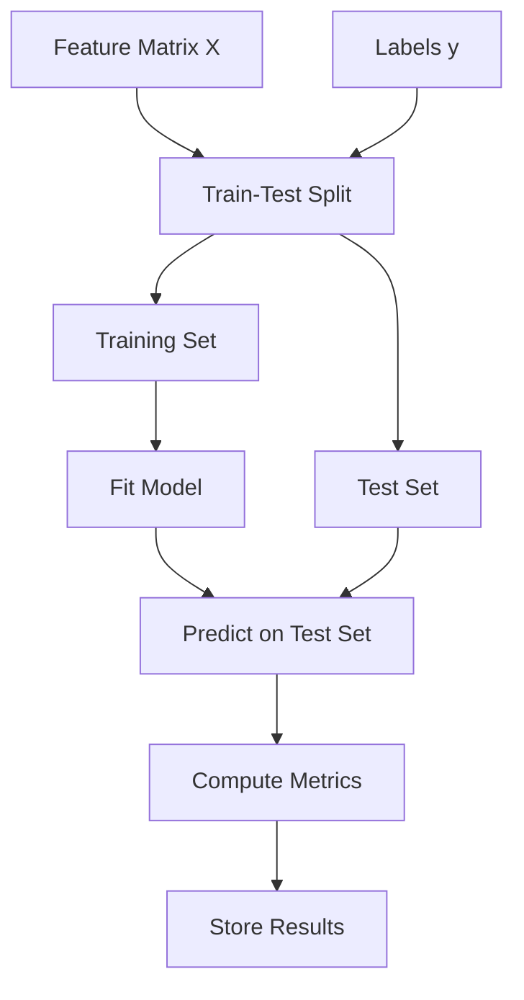

Este diseño permite comparar los modelos bajo las mismas condiciones experimentales.

---

## 14. Métricas de evaluación

La evaluación de los modelos se basa en métricas de clasificación supervisada.

| Métrica | Propósito |
|---|---|
| Accuracy | Medir la proporción total de predicciones correctas |
| Precision | Medir qué tan confiables son las predicciones positivas por clase |
| Recall | Medir qué tanto recupera el modelo de cada clase real |
| F1-score | Balance entre precision y recall |
| Confusion Matrix | Analizar errores entre clases específicas |

La matriz de confusión es especialmente útil en reconocimiento de emociones, porque permite observar qué emociones se confunden con mayor frecuencia.

---

## 15. Selección del modelo final

Después del entrenamiento y evaluación, los modelos se comparan para seleccionar el más adecuado.

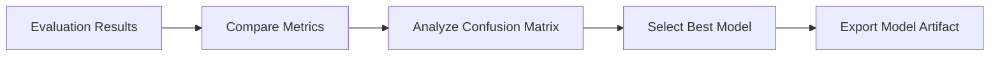

La selección no debe depender únicamente de accuracy. También se considera el balance entre clases, el comportamiento de la matriz de confusión y la estabilidad del modelo.

---

## 16. Artefacto final del modelo

El modelo seleccionado se guarda como artefacto para su uso posterior en inferencia.

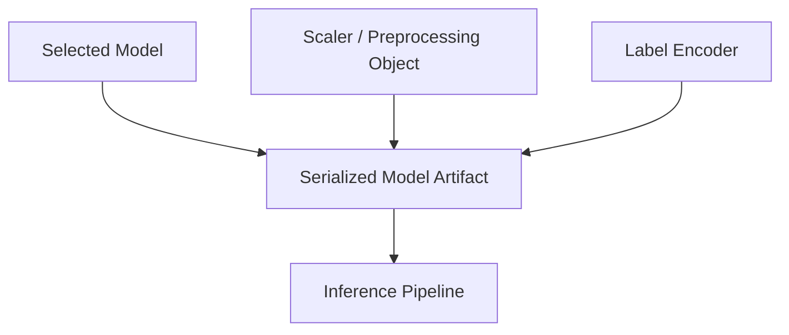

El artefacto final puede incluir:

```text
modelo entrenado
objeto de escalado
codificador de etiquetas
configuración de características
métricas de evaluación
```

---

## 17. Pipeline de inferencia

Durante la inferencia, una nueva muestra pasa por la misma representación de características y se envía al modelo seleccionado.

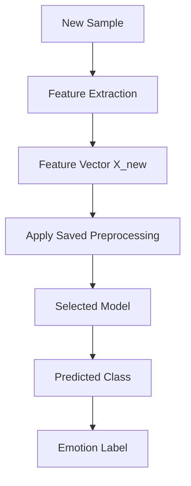

Esto garantiza que el modelo reciba las nuevas muestras en el mismo formato utilizado durante el entrenamiento.

---

## 18. Resumen profesional de la arquitectura

La arquitectura del bloque de modelos puede resumirse de la siguiente manera:

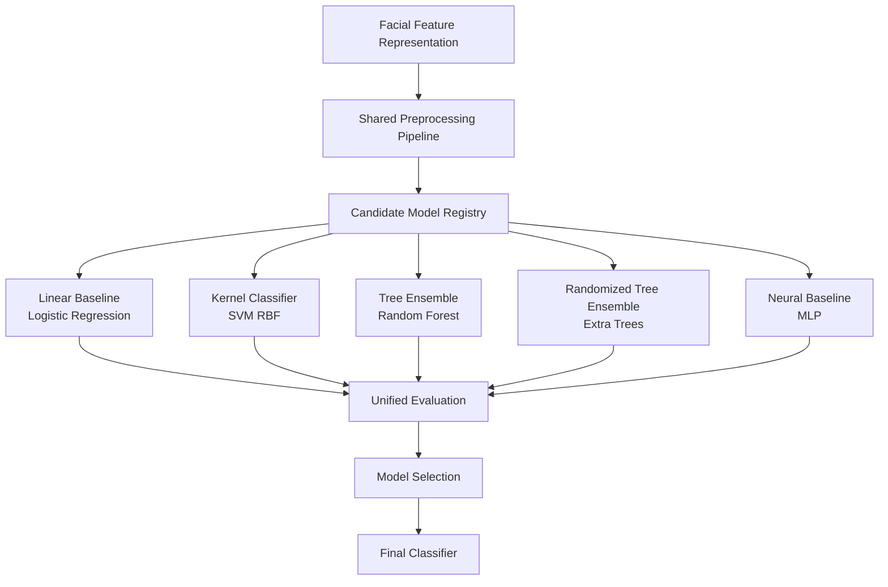

---

## 19. Nota sobre el uso de múltiples modelos

Aunque se utilizan varios modelos, esta arquitectura no debe describirse automáticamente como un ensamble final.

Un ensamble implicaría combinar formalmente las predicciones de varios modelos mediante votación, promedio de probabilidades, stacking u otra estrategia de fusión.

En este proyecto, los modelos se organizan como un conjunto de modelos candidatos dentro de una arquitectura experimental. Cada modelo se entrena y evalúa sobre la misma representación de entrada, y posteriormente se selecciona el de mejor desempeño.

Por lo tanto, el término más correcto es:

```text
arquitectura multi-modelo para comparación y selección de clasificadores
```

no:

```text
ensamble final de modelos
```

a menos que se implemente explícitamente una etapa de fusión de predicciones.

---

## 20. Conclusión

La arquitectura de modelos del proyecto está basada en una representación facial común y un conjunto de clasificadores supervisados. El flujo profesional consiste en construir un vector de características, aplicar un pipeline de preprocesamiento, entrenar distintos modelos candidatos, comparar su desempeño y seleccionar el mejor clasificador para la predicción final de emociones.

Los modelos utilizados cubren distintas familias de aprendizaje automático:

```text
Logistic Regression -> baseline lineal
SVM RBF -> modelo no lineal por kernel
Random Forest -> ensamble robusto de árboles
Extra Trees -> ensamble aleatorizado de árboles
MLP Classifier -> baseline neuronal multicapa
```

Esta organización permite presentar el proyecto de forma clara, modular y profesional dentro del repositorio.
