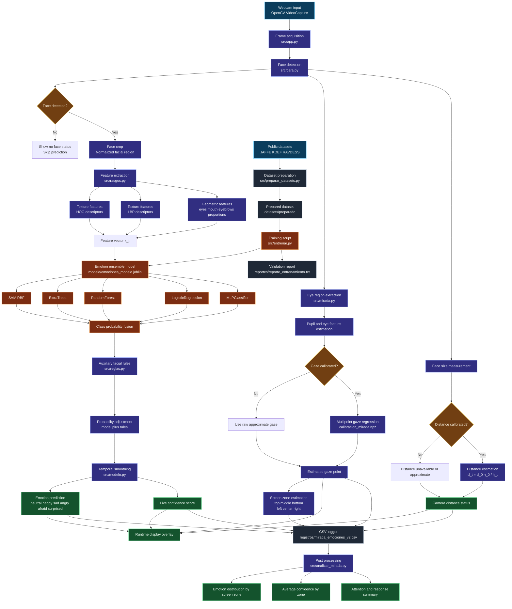

# System architecture

VisionPro is organized as a modular real time computer vision pipeline. The system combines facial emotion recognition, gaze estimation, distance approximation and behavioral logging.

## Module summary

The architecture separates training and runtime execution.

During training, public datasets are prepared and transformed into face crops. Then the emotion ensemble is trained and saved as a Joblib model.

During runtime, the webcam stream is processed frame by frame. The system detects the face, extracts features, predicts emotion, estimates gaze and distance, and stores synchronized interaction data.

## Main runtime modules

- `src/app.py`: main application loop.
- `src/cara.py`: face detection and cropping.
- `src/rasgos.py`: feature extraction.
- `src/modelo.py`: smoothing and confidence utilities.
- `src/reglas.py`: auxiliary facial rules.
- `src/mirada.py`: gaze estimation and calibration.
- `src/distancia.py`: distance and distance profile logic.
- `src/analizar_mirada.py`: post processing of gaze and emotion logs.

## Training modules

- `src/preparar_datasets.py`: prepares public datasets.
- `src/datasets_publicos.py`: dataset source handling.
- `src/entrenar.py`: trains the emotion recognition model.
- `reportes/reporte_entrenamiento.txt`: stores validation performance.

## Output files

- `modelo/emociones_modelo.joblib`: trained emotion model.
- `modelo/calibracion_mirada.npz`: runtime gaze calibration.
- `modelo/calibracion_distancia.npz`: runtime distance calibration.
- `registros/mirada_emociones_v2.csv`: synchronized log of emotion, gaze and distance.
