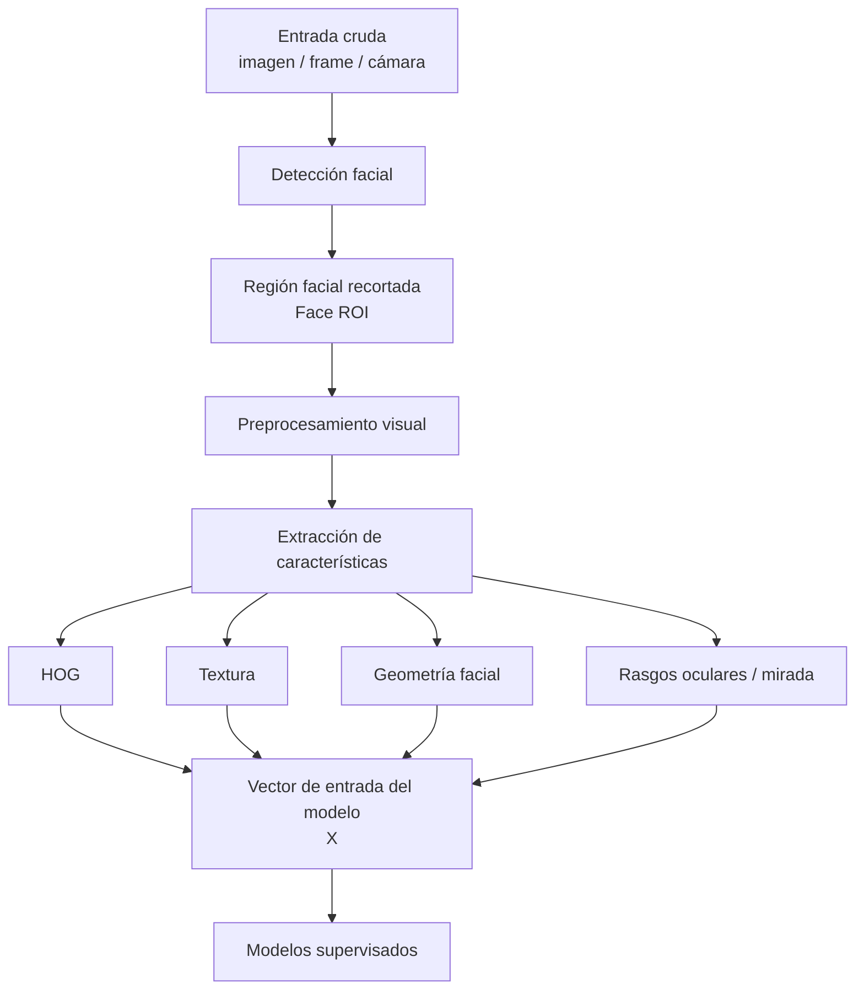
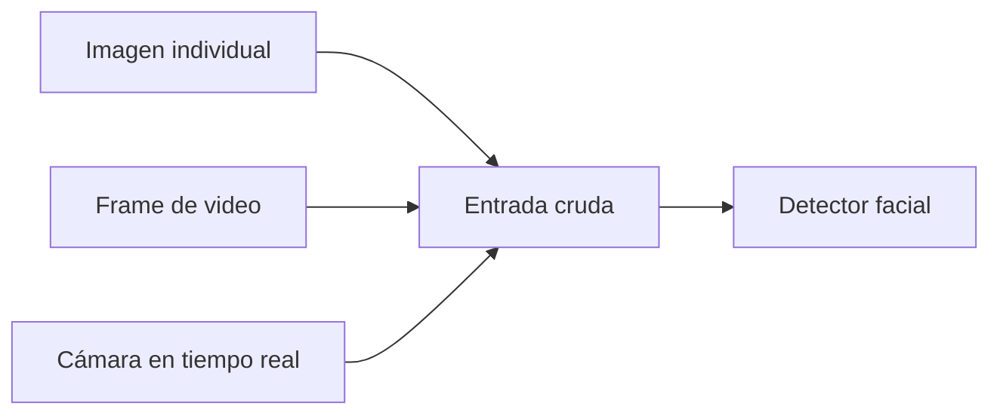
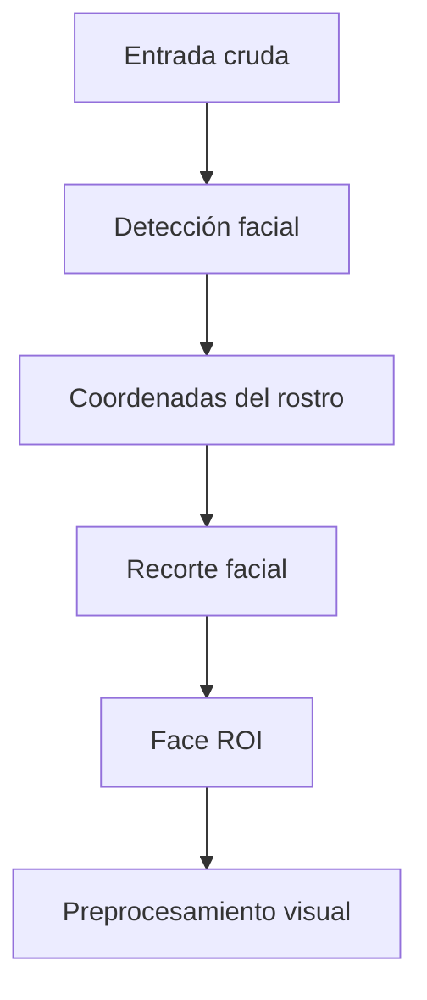
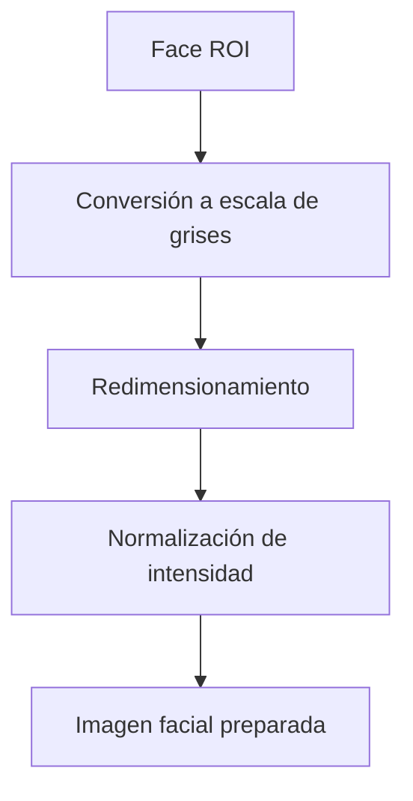
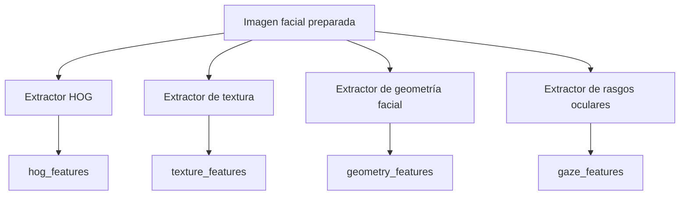
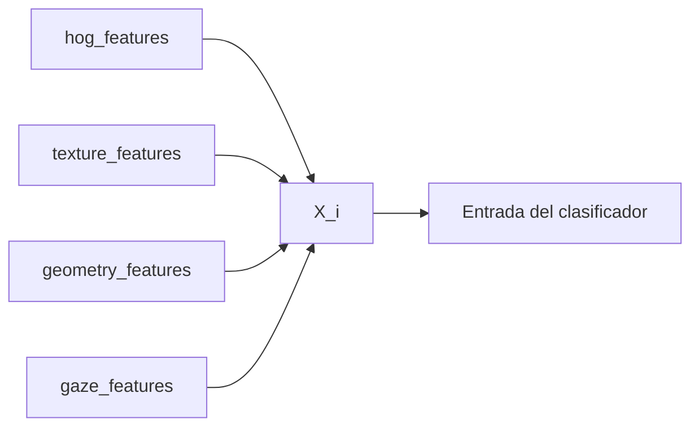
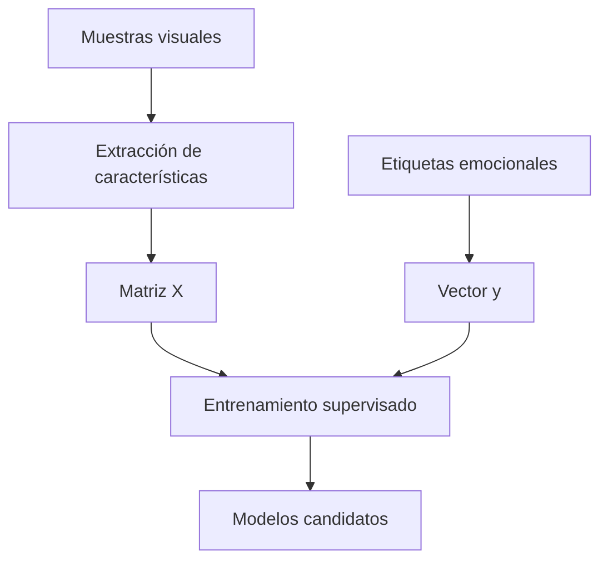
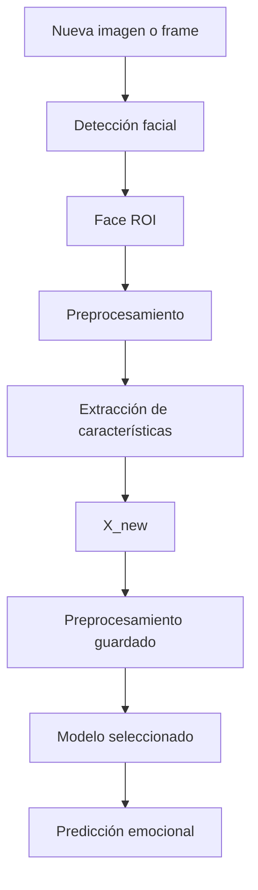
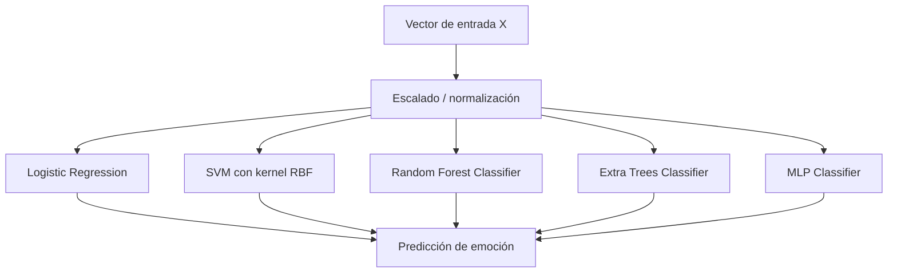

# Entradas del modelo

Este documento describe las entradas utilizadas por el bloque de modelos del sistema de reconocimiento de emociones.

El objetivo es dejar claro qué tipo de datos recibe el sistema, cómo se transforman y cuál es la entrada real que utilizan los modelos supervisados de clasificación.

---

## 1. Vista general de las entradas

La arquitectura distingue tres niveles principales de entrada:

1. Entrada cruda del sistema.
2. Entrada visual procesada.
3. Entrada numérica para los modelos de aprendizaje automático.



La entrada final de los modelos no es la imagen cruda, sino un vector numérico de características.

---

## 2. Niveles de entrada

| Nivel | Nombre | Descripción | Uso principal |
|---|---|---|---|
| Nivel 1 | Entrada cruda | Imagen, frame de video o captura desde cámara | Punto inicial del sistema |
| Nivel 2 | Entrada visual procesada | Rostro detectado, recortado y normalizado | Base para extraer características |
| Nivel 3 | Entrada del modelo | Vector numérico de características | Entrada directa de los clasificadores |
| Nivel 4 | Entrada supervisada | Pares `(X_i, y_i)` | Entrenamiento y evaluación |

---

## 3. Entrada cruda del sistema

La entrada cruda corresponde al dato visual original antes de cualquier procesamiento.

Puede provenir de:

```text
imagen individual
frame de video
captura en tiempo real desde cámara
```



Esta entrada todavía no se utiliza directamente para entrenar los modelos. Primero debe pasar por detección facial y preprocesamiento.

---

## 4. Entrada visual procesada

Después de detectar el rostro, se genera una región facial de interés conocida como `Face ROI`.



La `Face ROI` concentra la información relevante del rostro y elimina regiones no necesarias, como fondo, ropa o elementos externos.

---

## 5. Preprocesamiento de la entrada visual

La entrada visual procesada se estandariza antes de extraer características.



| Operación | Propósito |
|---|---|
| Conversión a escala de grises | Reducir complejidad visual |
| Redimensionamiento | Mantener tamaño uniforme |
| Normalización | Hacer comparables los valores de intensidad |
| Preparación facial | Generar una entrada estable para extracción de rasgos |

---

## 6. Entrada para extracción de características

La imagen facial preparada se usa como entrada para construir distintas familias de características.



Cada extractor produce un vector numérico parcial. Estos vectores se concatenan para formar la entrada real de los modelos.

---

## 7. Entrada real de los modelos

Los modelos supervisados no reciben directamente la imagen completa.

La entrada real de los modelos es un vector de características:

```text
X_i = [HOG_i, texture_i, geometry_i, gaze_i]
```

donde:

| Componente | Tipo | Descripción |
|---|---|---|
| `HOG_i` | Vector numérico | Gradientes, bordes y estructura facial |
| `texture_i` | Vector numérico | Patrones locales de textura |
| `geometry_i` | Vector numérico | Relaciones espaciales del rostro |
| `gaze_i` | Vector numérico | Información ocular, mirada o atención visual |



---

## 8. Contrato de entrada del modelo

El contrato de entrada define qué espera recibir el bloque de modelos.

| Elemento | Formato esperado | Obligatorio | Uso |
|---|---|---|---|
| `face_roi` | Imagen facial recortada | Sí | Base para extracción de características |
| `hog_features` | Vector numérico | Sí | Representación de bordes y gradientes |
| `texture_features` | Vector numérico | Según configuración | Complemento visual local |
| `geometry_features` | Vector numérico | Según configuración | Relaciones espaciales del rostro |
| `gaze_features` | Vector numérico | Según configuración | Rasgos oculares y mirada |
| `X_i` | Vector numérico concatenado | Sí | Entrada directa de los clasificadores |
| `y_i` | Etiqueta categórica | Solo entrenamiento | Emoción real asociada |

---

## 9. Entrada durante entrenamiento

Durante el entrenamiento, cada muestra se representa como un par supervisado:

```text
(X_i, y_i)
```

donde:

```text
X_i = vector de características de la muestra i
y_i = etiqueta emocional de la muestra i
```



La matriz `X` contiene todas las muestras representadas como vectores numéricos.  
El vector `y` contiene las clases emocionales correspondientes.

---

## 10. Entrada durante inferencia

Durante la inferencia, el sistema recibe una nueva muestra visual y produce una emoción estimada.



La nueva muestra debe pasar por el mismo proceso usado durante el entrenamiento.  
Esto asegura que el modelo reciba datos en el mismo formato.

---

## 11. Relación con los modelos utilizados

Todos los modelos usados reciben la misma entrada `X`.



Esto permite comparar los modelos de manera justa, ya que todos trabajan con la misma representación de entrada.

---

## 12. Resumen de entradas por componente

| Componente | Entrada | Salida |
|---|---|---|
| Detector facial | Imagen o frame | Coordenadas del rostro |
| Recorte facial | Coordenadas del rostro | Face ROI |
| Preprocesamiento | Face ROI | Imagen facial preparada |
| Extractores de características | Imagen facial preparada | HOG, textura, geometría y mirada |
| Concatenación | Vectores parciales | Vector `X_i` |
| Clasificadores | Vector `X_i` | Emoción predicha |
| Evaluación | Predicción y etiqueta real | Métricas de desempeño |

---

## 13. Resumen profesional

La entrada del bloque de modelos no debe entenderse únicamente como una imagen.  
En esta arquitectura, la imagen es la entrada inicial del sistema, pero la entrada real de los modelos supervisados es un vector de características construido a partir del rostro procesado.

El flujo correcto es:

```text
imagen o frame
-> rostro detectado
-> región facial procesada
-> extracción de características
-> vector X
-> clasificador supervisado
-> emoción predicha
```

Esta separación permite documentar de forma clara la diferencia entre entrada visual, entrada de extracción de rasgos y entrada directa de los modelos de aprendizaje automático.
